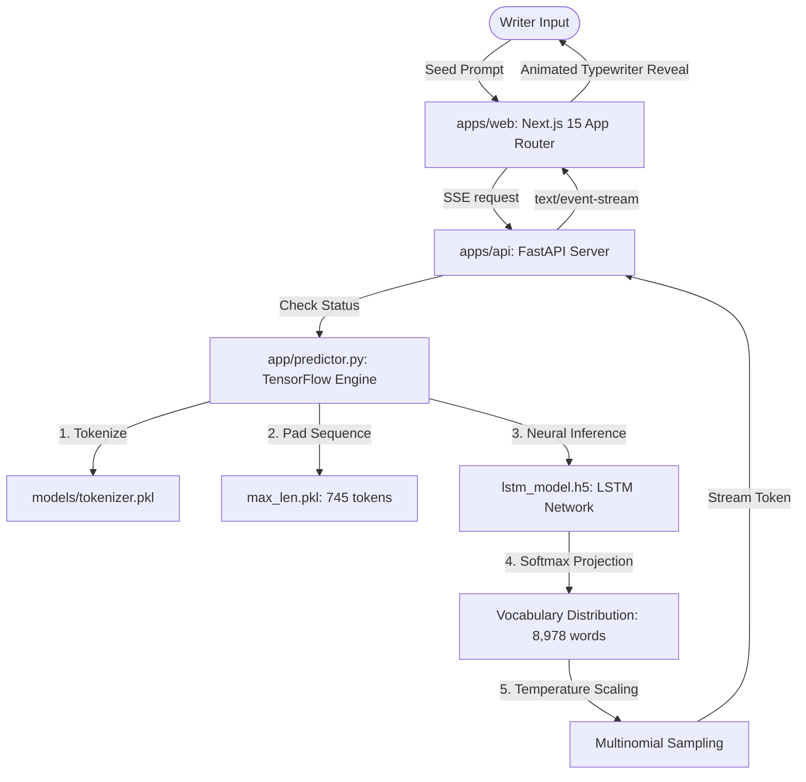

# Verra — Premium Neural Text Generation Platform

Verra is a creative writing workspace wrapped in a minimalist, distraction-free environment. Powered by recurrent neural networks (RNN/LSTM), it predicts and streams next-word continuations based on semantic context, helping writers expand their thoughts seamlessly.



---

## Technical Stack

- **Frontend**: Next.js 15 (App Router), React 19, TypeScript, Tailwind CSS v4, Zustand, Framer Motion, Recharts, Lucide React
- **Backend**: FastAPI, Uvicorn, TensorFlow, Keras, NumPy, Python 3.11
- **DevOps**: Docker, Docker Compose, GitHub Actions CI
- **Monorepo Manager**: npm workspaces

---

## Directory Architecture

```text
/ (Monorepo Root)
├── apps/
│   ├── web/                    # Next.js 15 App Router frontend (port 3000)
│   └── api/                    # FastAPI backend (port 8000)
├── packages/
│   ├── types/                  # Shared TypeScript interfaces
│   ├── config/                 # Shared configs (Tailwind, tsconfig)
│   └── ui/                     # Customized shadcn atomic components
├── docker/                     # Deployment Dockerfiles (web, api)
├── .github/                    # CI/CD workflows and issue templates
└── docker-compose.yml          # Multi-container execution file
```

---

## Getting Started

### Prerequisites
- Node.js 18+ and npm
- Python 3.11
- [uv](https://github.com/astral-sh/uv) (Recommended fast Python installer)

### 1. Installation
Install all monorepo dependencies and link workspaces:
```bash
npm install
```

### 2. Configure Model Weights
Verra runs authentic neural network inference. The backend requires the trained model weights:
1. Place your trained **`lstm_model.h5`** weight file inside:
   `apps/api/app/models/`
2. Ensure `tokenizer.pkl` and `max_len.pkl` exist in that same folder (already preloaded).

*If the model weights are not found on startup, Verra Studio will enter **Setup Mode** and display visual instructions on how to load it, keeping generation triggers safely locked.*

### 3. Local Development Run
Launch both Next.js and FastAPI concurrently in watch mode:
```bash
npm run dev
```
- **Web Frontend**: [http://localhost:3000](http://localhost:3000)
- **FastAPI Documentation**: [http://localhost:8000/docs](http://localhost:8000/docs)

### 4. Running with Docker
Emulate a production deployment locally:
```bash
docker-compose up --build
```

---

## Keyboard Shortcuts

Verra is designed for seamless keyboard navigation. Press `?` inside the Studio to open the cheat sheet:

| Combination | Action |
|-------------|--------|
| `⌘ / Ctrl + Enter` | Trigger next-word generation stream |
| `⌘ / Ctrl + K` | Toggle global Search Command Palette |
| `⌘ / Ctrl + Shift + C` | Copy current writing output |
| `?` | Toggle keyboard shortcuts modal overlay |
| `Esc` | Close active dialogs, overlays, or palettes |
| `F` | Toggle distraction-free Focus Mode |

---

## Product Roadmap

- [ ] **Custom Style Transfer**: Support sliders to shift model focus between different historical authors.
- [ ] **Multinomial Top-K Filter**: Restrict multinomial sampling to the top K highest-probability words for faster syntax convergence.
- [ ] **Offline Standalone PWA**: Run lightweight, compiled WebAssembly LSTM tensors directly in-browser.

---

## License

MIT License. See [LICENSE](LICENSE) file for more information.
