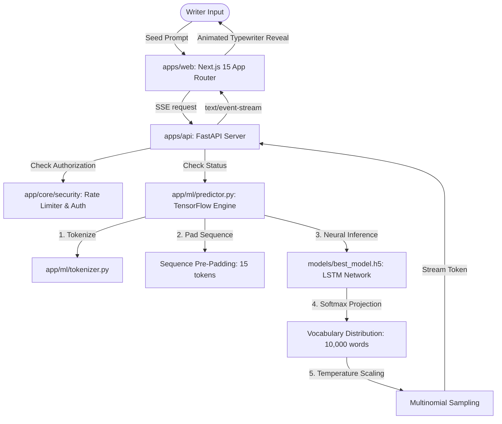

# Verra v1.0 — Premium Neural Text Writing Companion

Verra is a premium creative writing workspace wrapped in a minimalist, distraction-free environment. Powered by recurrent neural networks (LSTM), it predicts and streams next-word continuations based on semantic context, helping writers expand their thoughts seamlessly.



---

## Technical Stack & Architecture

- **Frontend**: Next.js 15 (App Router), React 19, TypeScript, Tailwind CSS v4, Zustand, Framer Motion, Recharts, Lucide React
- **Backend**: FastAPI, Uvicorn, SQLAlchemy 2.0 (Declarative Base), Alembic (Schema Migrations), TensorFlow, Keras, NumPy, PyJWT
- **Database**: SQLite (Development) / PostgreSQL (Production ready)
- **Security**: PBKDF2 Password Hashing, JWT Bearer Token validation, Client IP Rate Limiting
- **Monitoring**: Structured logging with credential filtering, health check endpoints, and in-memory latency/failures metrics collector
- **DevOps**: GitHub Actions CI/CD, docker-compose (separate Dev & Prod targets)

---

## Directory Architecture

```text
/ (Monorepo Root)
├── apps/
│   ├── web/                    # Next.js 15 App Router frontend (port 3000)
│   └── api/                    # FastAPI backend & ML predictor (port 8000)
│       ├── app/
│       │   ├── api/            # API routers (auth, documents, prediction, settings, health)
│       │   ├── core/           # Security, config settings, and logger
│       │   ├── db/             # SQLAlchemy session and Alembic migrations
│       │   ├── ml/             # Tokenizer and TensorFlow predictor
│       │   ├── models/         # Keras weights (best_model.h5)
│       │   ├── schemas/        # Pydantic validation schemas
│       │   └── services/       # Business logic (auth, documents, predictions)
│       ├── run_tests.py        # Zero-dependency backend test suite
│       └── alembic.ini         # Alembic migration configuration
├── docker/                     # Deployment Dockerfiles (web, api)
├── .github/                    # CI/CD workflows and configurations
├── docker-compose.dev.yml      # Local dev hot-reload compose file
└── docker-compose.prod.yml     # Production immutable containers compose file
```

---

## Getting Started

### Prerequisites
- Node.js 20+ and npm
- Python 3.11
- [uv](https://github.com/astral-sh/uv) (Recommended fast Python package manager)

### 1. Local Monorepo Setup
Install all frontend and shared dependencies:
```bash
npm install
```

### 2. Configure Backend Environment
1. Setup Python virtual environment and install dependencies:
   ```bash
   cd apps/api
   python3 -m venv venv
   source venv/bin/activate
   pip install -r requirements.txt
   ```
2. Copy the configuration template:
   ```bash
   cp .env.example .env
   ```
3. Place your trained **`best_model.h5`** or **`lstm_model.h5`** weight file inside `apps/api/app/models/`.

### 3. Running Locally
Run both Next.js and FastAPI concurrently:
```bash
npm run dev
```
- **Web Frontend**: [http://localhost:3000](http://localhost:3000)
- **FastAPI Documentation**: [http://localhost:8000/docs](http://localhost:8000/docs)

---

## Running with Docker (Recommended)

### Development Environment (Hot-Reloading)
Launch containers with local workspace directories mounted:
```bash
docker-compose -f docker-compose.dev.yml up --build
```

### Production Environment (Immutable Containers)
Launch optimized production standalone containers with a named SQLite database volume:
```bash
docker-compose -f docker-compose.prod.yml up --build
```

---

## Production Security & Features

### 1. Database & Migrations
- **SQLAlchemy 2.0 & Alembic**: Database interactions are fully structured. Schema migrations are automatically executed on startup (`alembic upgrade head`), falling back safely to `Base.metadata.create_all` if Alembic is uninitialized.
- **Production PostgreSQL Support**: To swap SQLite for a cloud database (Supabase, Railway, Neon), simply override `DATABASE_URL` in the environment variables.

### 2. Authentication & Guest Session Migration
- Authentic credentials authentication using **HMAC-SHA256 JWT tokens** and **PBKDF2 password hashing** (via Python's standard `hashlib`).
- **Guest Mode Transition**: Writes started in Guest Mode (`localStorage`) are automatically uploaded and synced to the database space upon signup or login. If a document title already exists, Verra intelligently renames it (appending `(Local Copy)`) to prevent overwrites.

### 3. Rate Limiting Limits
To secure endpoints from request floods, the API enforces thread-safe in-memory rate limiting based on client IP:
- **Prediction Requests**: 20 requests / minute
- **Document Saves**: 100 requests / minute
- **Login Attempts**: 10 attempts / minute

### 4. System Metrics & Monitoring
Retrieve runtime performance data at `GET /api/health/metrics`:
- Uptime statistics
- Average prediction latency (ms) and prediction failure rates
- Average prediction confidence percentage
- Total database transactions and average database latency (ms)
- Autosave failures

---

## Keyboard Shortcuts

| Combination | Action |
|-------------|--------|
| `⌘ / Ctrl + Enter` | Trigger next-word generation stream |
| `⌘ / Ctrl + K` | Toggle global Search Command Palette |
| `⌘ / Ctrl + S` | Force save current draft to cloud |
| `Esc` | Close active dialogs, overlays, or palettes |
| `F` | Toggle distraction-free Focus Mode (dims UI, centers canvas) |
