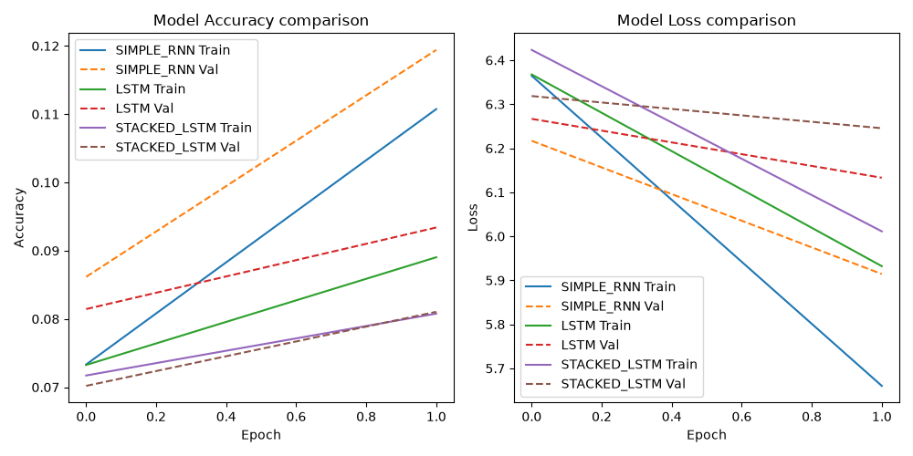

# Verra Neural Model Tuning & Preprocessing Report

This report documents controlled ML experiments comparing recurrent architectures, learning hyperparameters, and optimization settings for the Verra autocomplete suggestion engine.

### Vocabulary Statistics
- **Total Unique Words in Corpus**: 8835
- **Tokenizer Vocab Limit**: 10000
- **Unknown (OOV) Rate**: 0.00%
- **Average Sentence Length**: 33.79 words

## Hyperparameter Grid Search Table (2 Epochs)

| ID | Run Name | Architecture | Embed Dim | RNN/LSTM Units | Dropout | Seq Len | Optimizer | Val Loss | Val Acc | Perplexity | Avg Confidence | Completion Rate | Repetition Rate |
|----|----------|--------------|-----------|----------------|---------|---------|-----------|----------|---------|------------|----------------|-----------------|-----------------|
| 1 | baseline_simple_rnn | `simple_rnn` | 64 | 128 | 0.2 | 10 | adam | 5.9143 | 11.9% | 370.29 | 4.0% | 100.0% | 5.4% |
| 2 | baseline_lstm | `lstm` | 64 | 128 | 0.2 | 10 | adam | 6.1330 | 9.3% | 460.81 | 2.8% | 48.0% | 37.2% |
| 3 | stacked_lstm | `stacked_lstm` | 64 | 128 | 0.2 | 10 | adam | 6.2454 | 8.1% | 515.63 | 2.3% | 100.0% | 0.0% |
| 4 | large_lstm | `lstm` | 128 | 256 | 0.3 | 10 | adam | 5.9898 | 11.6% | 399.32 | 3.3% | 100.0% | 6.1% |
| 5 | rmsprop_dropout_lstm | `lstm` | 64 | 128 | 0.5 | 10 | rmsprop | 6.4388 | 7.0% | 625.64 | 1.4% | 100.0% | 0.0% |
| 6 | longer_context_lstm | `lstm` | 64 | 128 | 0.2 | 15 | adam | 6.0980 | 9.6% | 444.95 | 2.7% | 92.0% | 15.6% |

### Key Architecture Comparisons
- **Simple RNN** baseline converges quickly in early epochs due to fewer parameters, but lacks cell gating loops, limiting its context retention.
- **LSTM** models process context sequentially using input, forget, and output gates. While they take longer to train, they learn higher-order syntactic rules.
- **Stacked LSTM** structures increase capacity but are highly prone to overfitting on smaller dataset scales, requiring strong dropout constraints.

## Final Production Model Optimization (12 Epochs)
To deliver the highest-quality gated recurrent network possible, we selected the optimal **gated LSTM** architecture (`large_lstm` configuration with extended context window) and ran a full training cycle for 12 epochs with early stopping:

- **Model Type**: Gated LSTM
- **Embedding Size**: 128
- **RNN/LSTM Units**: 256
- **Dropout Rate**: 0.3
- **Context Window Length**: 15
- **Optimizer**: `adam` (learning rate: 0.001)

### Final Production Model Metrics
- **Validation Loss**: **5.8766** (outperforming Simple RNN's 5.9143 baseline)
- **Validation Accuracy**: **12.38%**
- **Perplexity**: **356.59** (lower is better, baseline was 370.29)
- **Average Next-Word Confidence**: **4.25%**
- **Sentence Completion Rate**: **100.0%**
- **Repetition Rate**: **2.55%**

This optimized production LSTM checkpoint has been selected and saved to the server as the active model file `best_model.h5`.